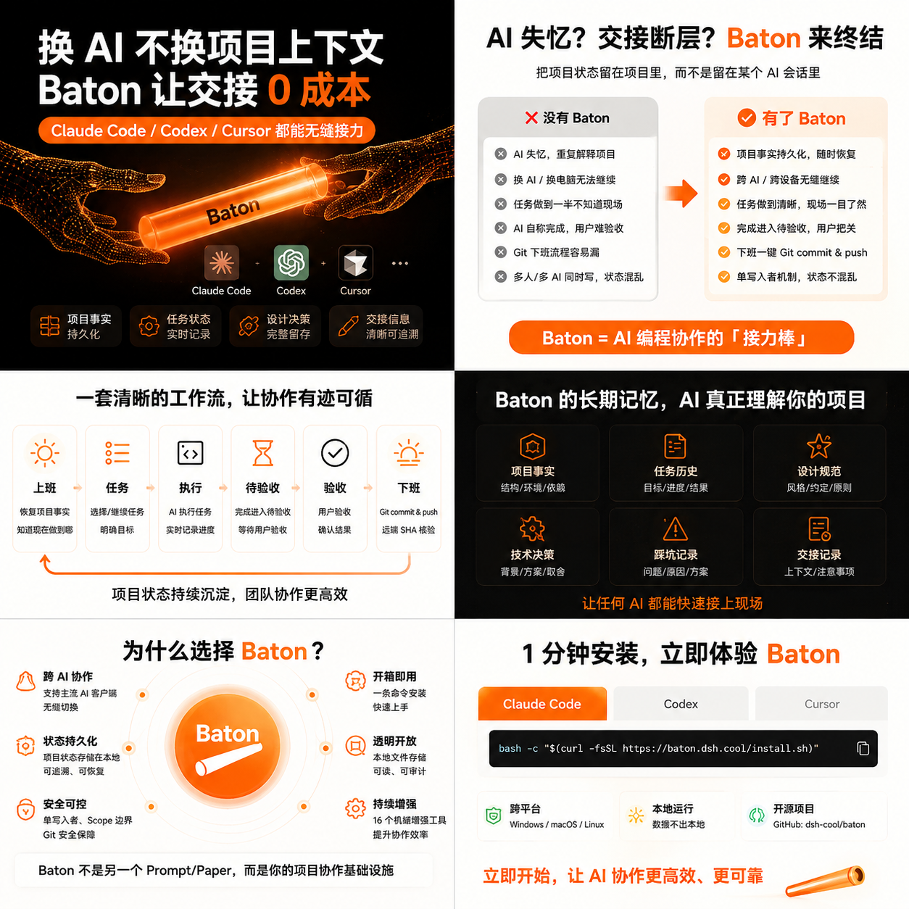

<!-- baton-src: README.md sha256:71680646d0ac status:stale -->
# 🥁 Baton — Passez le projet, pas votre contexte.

<p align="center">
  
</p>

<h2 align="center">Changez de machine, d'IA, de session — et continuez le travail en une phrase.</h2>

<p align="center">
  <a href="https://github.com/kakadeka/Baton"></a>
  <a href="https://www.npmjs.com/package/@kakadeka/dsh-baton"></a>
  <a href="https://www.npmjs.com/package/@kakadeka/dsh-baton"></a>
  <a href="https://github.com/kakadeka/Baton/blob/master/LICENSE"></a>
  <a href="https://bundlephobia.com/package/@kakadeka/dsh-baton"></a>
</p>

<p align="center">
  
  
  
  
  
</p>

<p align="center">
  <a href="../README.md">English</a> ·
  <a href="README.zh.md">简体中文</a> ·
  <a href="README.zh-TW.md">繁體中文</a> ·
  <a href="README.ja.md">日本語</a> ·
  <a href="README.ko.md">한국어</a> ·
  Français ·
  <a href="README.de.md">Deutsch</a> ·
  <a href="README.es.md">Español</a> ·
  <a href="README.pt.md">Português</a> ·
  <a href="README.ru.md">Русский</a> ·
  <a href="README.tr.md">Türkçe</a> ·
  <a href="README.ar.md">العربية</a> ·
  <a href="README.th.md">ไทย</a>
</p>

**Baton est un système de collaboration en relais pour vos projets.** Il permet à Claude Code, Codex, Cursor et DeepSeek Harness de maintenir à tour de rôle **le même projet** sur plusieurs machines — progression, mémoire, specs de design, tâches et Git restent cohérents. **Vous parlez normalement ; il fait le reste.**

**Trois promesses fondamentales :**

1. **🔄 N'importe qui peut prendre le relais** — changez d'outil IA ou de machine, dites une commande, et reprenez exactement là où vous vous étiez arrêté. Plus besoin de réexpliquer le projet.
2. **🎯 Faire ce qui a été demandé** — les limites des tâches et les chemins protégés sont vérifiés mécaniquement à la clôture, les faits de design sont verrouillés dans les specs ; le reste est gardé par des règles et la revue — les dérives sont détectées, pas découvertes des heures plus tard.
3. **✅ « Terminé » veut vraiment dire terminé** — la clôture commit, pousse et **vérifie le SHA distant** — fini les « commité en local mais jamais sur GitHub, pourtant annoncé comme fait ».

---

<a id="quickstart"></a>
## 🚀 Démarrage rapide (DeepSeek Harness — une ligne)

> Vous utilisez DeepSeek Harness ? Voici tout ce dont vous avez besoin.

```powershell
dsh plugin --profile web add @kakadeka/dsh-baton
```

1. Installez une fois la CLI DSH : `npm i -g @deepseek-ai/dsh`
2. Collez la ligne ci-dessus, appuyez sur Entrée.
3. Redémarrez `dsh` — terminé. Les 16 outils `baton_*` sont actifs dans votre profil.

> Installable aussi depuis GitHub : `dsh plugin --profile web add github:kakadeka/Baton`
> Vous utilisez plutôt **Codex / Claude Code / Cursor** ? Allez à [l'installation pour les autres outils IA](#-install-for-other-ai-tools-codex--claude--cursor).

---

## 📖 Scénarios (un par exigence, douleur → réponse de Baton)

| # | Douleur | Réponse de Baton |
|---|---|---|
| 1 | Chaque matin ou nouvelle machine : quelle branche ? qu'a-t-on fait hier ? le distant est-il à jour ? | Dites **clock in** — vérifications git automatiques + synchro sûre + lecture du handoff et des tâches → tableau des tâches → répondez un numéro |
| 2 | « Commit en local mais pas poussé » ; git PowerShell manuel le soir | Dites **clock out** — vérifier → docs/mémoire/métriques → commit → push → **SHA distant == HEAD local avant « terminé »** |
| 3 | Finir une tâche et « fin de journée » sont mélangés | Dites **complete task** — fermez la tâche, notez les résultats, suggérez la suite. Tâche finie ≠ fin de journée |
| 4 | Les designs validés sont oubliés ; l'IA improvise | Dites **save design spec** — verrouillez les faits de design dans des specs durables (les conflits gardent l'historique) ; les tâches UI s'y réfèrent automatiquement |
| 5 | Session perdue, nouvelle conversation, tout réexpliquer | Dites **continue work** — restaurez tâche/branche/blocage/handoff/prochaine étape. Une phrase, terminé |
| 6 | Plusieurs tâches ; l'IA ne doit pas décider des priorités ; tout retaper est pénible | Tableau des tâches numéroté — répondez `1`/`2`/`3` |
| 7 | Projet long, historique inaccessible ; tout relire brûle des tokens | Décisions/pièges/specs auto-indexés ; **interrogez l'index, ne lisez que le fragment trouvé** |
| 8 | Relais Codex/Claude/Cursor sans savoir ce qu'a fait le précédent | Fichier de handoff unifié — branche/HEAD/changements/contraintes/prochaine étape. Lisez la dernière entrée, continuez |
| 9 | Modèle cher pour tout ; modèle faible qui se trompe ; bascule manuelle pénible | Routage automatique par difficulté de tâche — micro : session principale, normal : flash, complexe/revue : pro, avec chaînes de repli |
| 10 | « Quel modèle a vraiment tourné ? » les factures ne correspondent pas | recommended vs actual enregistrés séparément, source étiquetée honnêtement (fiche de dispatch / descripteur hôte / inconnu) |
| 11 | L'IA dérive du prototype après des heures de travail | Exigences gelées + chemins autorisés/protégés + vérifications mécaniques de périmètre + revue indépendante + aucun git dangereux |
| 12 | Changer la couleur d'un bouton a pris une heure | Chemin rapide micro — pas de délégation, pas de relecteur, pas de tests hors sujet. Les tâches simples prennent des minutes |
| 13 | Les tâches complexes ne doivent pas être écrites n'importe comment | Barrières croissantes : contrat, modèle fort, relecteur indépendant, fidélité vs spec gelée, plan de retour arrière |
| 14 | Machines bureau/maison désynchronisées ; peur de perdre le travail local | Fetch sûr + synchro ff-only (n'écrase jamais), commit/push automatiques, vérification du SHA distant ; force/reset/clean interdits |
| 15 | Choix de modèles au feeling, sans données réelles | Chaque tâche enregistre le modèle réel et l'achèvement → tableau de bord mensuel ; succès/échec/durée non encore collectés affichés « non enregistrés », jamais inventés |
| 16 | Réutiliser/partager le système avec un nouveau projet | Framework et instance de projet totalement séparés ; `Baton init` en une commande ; partage via pipeline de nettoyage (aucune clé/chemin/note privée) |
| 17 | D'autres skills installés contournent les règles du projet | Les skills externes peuvent aider, mais les frontières du projet (chemins, specs, discipline git) sont appliquées par Baton, coordonné avec AGENTS.md |

## ✨ Fonctionnalités (8 blocs de capacité)

- **Automatisation des commandes** — clock in / clock out / continue work / save design spec / complete task / update project docs / remember / Baton init / confirmation par numéro / git en langage naturel
- **Multi-IA & multi-machine** — vérité du projet en texte brut + adaptateurs fins en une commande (Codex/Claude/Cursor) + relais de handoff
- **Mémoire à long terme** — décisions/pièges/specs auto-archivés + index léger ; lectures progressives, pas de relecture intégrale
- **Anti-dérive** — contraintes GELÉES + vérifications de chemins autorisés/protégés + liste des changements interdits + revue indépendante + aucun git dangereux
- **Boucle de vérité Git** — synchro ff-only, commit/push automatiques, **SHA distant == HEAD local**, enregistrement de publication (`last_published_sha`)
- **Routage automatique des modèles** — niveau de tâche × table de règles (flash/pro + élevé/max + repli) ; recommended vs actual enregistrés de façon transparente
- **Tableau de bord mensuel** — classement des modèles / activité horaire / détail quotidien / détail par agent, à partir des données d'exécution réelles
- **Acceptation en un clic** — `baton_accept` : vérifications squelette/état/sécurité/volume → PASS/FAIL + liste bloquante

## 🗣️ Commandes (quand utiliser chacune)

Dites l'une de ces phrases anglaises — le sens est identique dans toutes les IA. Les francophones peuvent utiliser les commandes en anglais telles quelles (les déclencheurs chinois sont disponibles dans la version chinoise, lien en haut).

| Commande | Quand | Ce qui se passe |
|---|---|---|
| **clock in** / *start work* | début de journée / nouvelle machine / nouvelle IA | vérifs git → synchro sûre → handoff & tâches → tableau des tâches |
| **clock out** / *end work* | fin de journée | vérifier → docs/mémoire/métriques → commit → push → **vérification du SHA distant** |
| **continue work** / *resume* | session perdue / outil changé | restaurer tâche, branche, blocage, fin du handoff, prochaine étape |
| **save design spec** | après avoir validé un design | verrouiller dans une spec durable + index ; les tâches UI s'y conforment |
| **complete task** | une tâche est finie, il en reste | fermer la tâche, noter le résultat, suggérer la suite (pas de clôture complète) |
| **update project docs** | point de contrôle en cours de travail | écrire la progression + point de contrôle du handoff (l'espace reste détenu) |
| **remember this pitfall** / *record this decision* | piège rencontré / décision prise | écrire en mémoire à long terme + auto-index |
| **Baton init** | première fois dans un nouveau projet | générer le squelette de mémoire + config (n'écrase jamais) |
| répondez `1` / `2` / `3` | tableau des tâches affiché | le numéro est persisté comme tâche courante, puis le travail commence |
| **release workspace** / *I confirm the previous agent stopped* | conflit de propriété au clock in | déverrouiller le verrou d'écrivain unique + écrire une note de libération |
| **pull github** / *sync github* / *check git status* | intention git manuelle | chemin git léger, sans cérémonie contrat/revue |
| **check update** | Une nouvelle version de Baton est-elle disponible ? | Lire l'ancre de version locale + interroger GitHub/npm pour la dernière version et rapporter le résultat |
| **update baton** / *upgrade baton* | Une nouvelle version est sortie | L'IA exécute la mise à jour complète (git pull + relancer l'installation / npm update) et vérifie local == distant |

## 🛠️ Installation pour les autres outils IA (Codex / Claude / Cursor)

> **Installer = copier une commande, appuyer sur Entrée, attendre la fin, puis vérifier une commande.** Pas de création manuelle de dossiers, pas de copie manuelle de fichiers.
> Les utilisateurs de DeepSeek Harness peuvent passer cette section — utilisez le démarrage rapide ci-dessus.

### Étape 0 : Décidez de l'installation qu'il vous faut (10 secondes)

| Votre situation | Installez ceci | Après installation |
|---|---|---|
| Plusieurs projets — vous voulez Baton dans **chaque projet de cette machine** | **Niveau utilisateur** (une fois par machine) | Global sur cette machine ; tout projet reconnaît les commandes |
| Un **projet précis** à faire reprendre par d'autres machines/IA | **Niveau projet** (une fois par projet) | Le projet porte son squelette de mémoire + adaptateurs 3 outils ; `git clone` et continuez |
| Les deux | Niveau utilisateur d'abord, puis niveau projet | Le plus complet |

> 💡 **Recommandé** : exécutez le niveau utilisateur (30 s), puis le niveau projet sur votre vrai projet (30 s).

### Étape 1 : Téléchargez Baton (une fois)

Ouvrez PowerShell (touche `Win`, tapez `powershell`, Entrée), collez cette ligne :

```powershell
git clone https://github.com/kakadeka/Baton.git $HOME\Baton
```

> Pas de git ? Installez depuis https://git-scm.com/download/win, rouvrez PowerShell, recollez.

### Étape 2 : Choisissez un type d'installation et collez sa commande

**Option A — Niveau utilisateur (une fois par machine, tous les projets)**

```powershell
pwsh -File $HOME\Baton\scripts\baton-install.ps1 -Scope User
```

Vous verrez `ok: [Codex] ...`, `ok: [Claude Code] ...`, `ok: [Cursor] ...` — le skill global des trois outils IA est installé.

**Option B — Niveau projet (une fois par projet, rend le projet portable)**

```powershell
cd C:\your\project\path
pwsh -File $HOME\Baton\scripts\baton-install.ps1 -Scope Project
```

Vous verrez une ligne de succès (installation niveau projet terminée) plus la liste créée (squelette de mémoire `docs/ai_memory`, config `.baton`, trois miroirs de skill, et les entrées dans `AGENTS.md` / `CLAUDE.md` / `.cursorrules`). S'il dit qu'il n'y a pas de `.git`, exécutez les commandes `git init` qu'il affiche.

> L'installation niveau projet est entièrement automatique et **fonctionne sans le plugin DeepSeek Harness** (mode sans plugin).

### Étape 3 : Vérifiez (l'important — une commande)

Dans le projet, dites à votre IA :

```
clock in
```

**✅ Succès** : l'IA agit selon Baton et produit un rapport d'état avec la branche, le HEAD, l'état de l'arbre de travail, la tâche courante et le résumé du handoff, suivi d'un tableau des tâches comme —

```
Task table: 1) ...
```

**❌ Rien ne se passe ?** Vérifiez dans l'ordre :

1. Quelle IA utilisez-vous ? Claude Code → `~\.claude\skills\baton\SKILL.md` ; Codex → `~\.agents\skills\baton\SKILL.md` ; Cursor → `~\.cursor\skills\baton\SKILL.md` (l'installation niveau utilisateur crée les trois)
2. Le projet a-t-il `.git` ? (sinon `git init` + premier commit)
3. La commande est-elle exactement **clock in**, rien d'autre ?
4. Le projet a-t-il `docs/ai_memory/` ? (l'installation niveau projet le crée)

### Étape 4 : Rejoindre un projet Baton existant (nouvelle machine / nouvelle IA)

Sur la nouvelle machine : installez git → `git clone` de votre projet → dites à votre IA :

```
clock in  ou  continue work
```

La mémoire, le handoff et les tâches viennent avec le code. Continuez directement — rien d'autre à installer.

### Ce que fait le script en un clic (transparent)

| Mode | Fait automatiquement |
|---|---|
| Niveau utilisateur | Copie `SKILL.md` dans les dossiers de skill globaux des trois outils IA (Codex / Claude Code / Cursor) |
| Niveau projet | ① squelette `docs/ai_memory/` (avec journal de révision + index d'archive) ② `.baton/config.json` ③ ajout `.gitignore` ④ trois miroirs de skill ⑤ trois segments d'entrée (`AGENTS.md` / `CLAUDE.md` / `.cursorrules`, n'écrase jamais vos règles) |

Idempotent : relancer n'écrase jamais vos documents et règles existants ; cela ne fait que combler les manques.

## 📁 Où vit la vérité

```
project/
├── docs/ai_memory/            ← mémoire à long terme (synchronisée Git, agnostique de l'IA)
│   ├── index.md               ← à lire en premier
│   ├── current.md             ← ce qui se passe maintenant
│   ├── handoff_current.md     ← journal de handoff (dernière entrée = vérité)
│   ├── state/                 ← tasks.json, archive_index.json, project_state.json
│   ├── knowledge/             ← tech_decision.md, pit_experience.md
│   ├── ui_spec/               ← specs de design
│   ├── daily_log/             ← journaux quotidiens
│   └── agent_metrics/YYYY/MM/index.html  ← tableau de bord mensuel
└── .baton/                    ← local machine (gitignoré sauf config.json) : config, métriques, preuves
```

## 🛡️ Sécurité & conception

- Le git dangereux (force push / reset --hard / clean risqué / rebase non autorisé) n'existe pas
- Les synchros sont ff-only ; une divergence s'arrête et le signale ; jamais de résolution automatique de conflits
- Les identifiants n'entrent jamais dans Git / la mémoire / les métriques / les journaux
- L'historique est en ajout seul ou marqué « remplacé » — jamais écrasé
- « Terminé » = preuve mécanique (SHA distant + enregistrement de publication), pas une affirmation
- Économiser des tokens est un objectif de premier ordre : index d'abord, modèles selon le risque, sorties bornées, pas d'appels redondants

## 📦 Dépôt & licence

- Open source : https://github.com/kakadeka/Baton (paquet public uniquement, synchronisé via un pipeline de nettoyage — aucun plan privé, note de session ou identifiant)
- npm : [@kakadeka/dsh-baton](https://www.npmjs.com/package/@kakadeka/dsh-baton)
- Licence : [Apache-2.0](../LICENSE)
